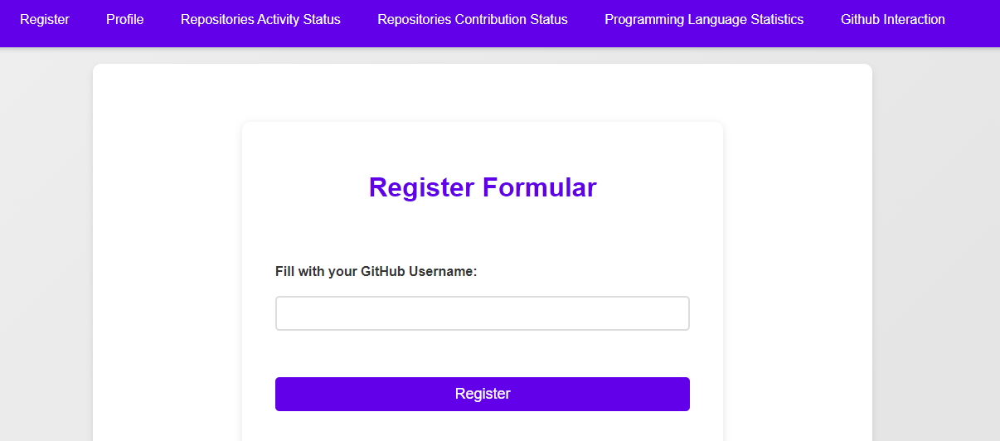
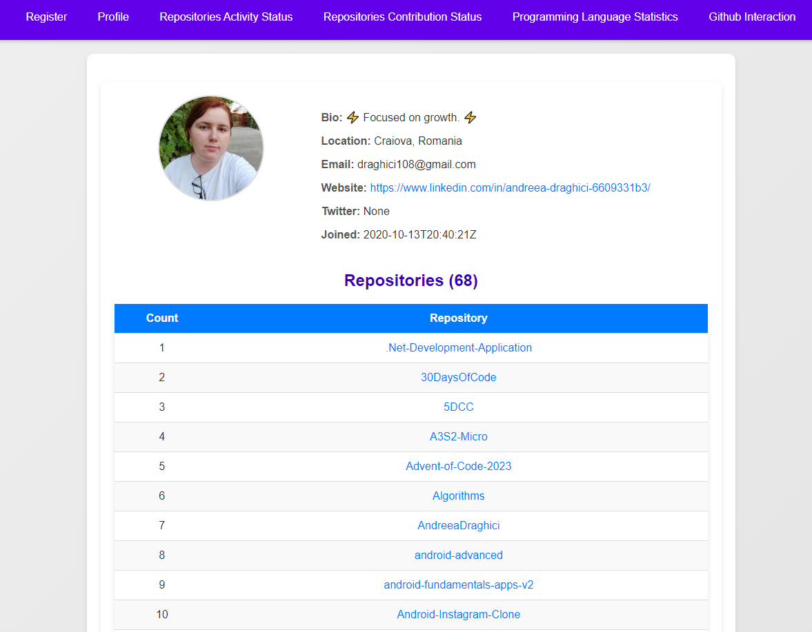
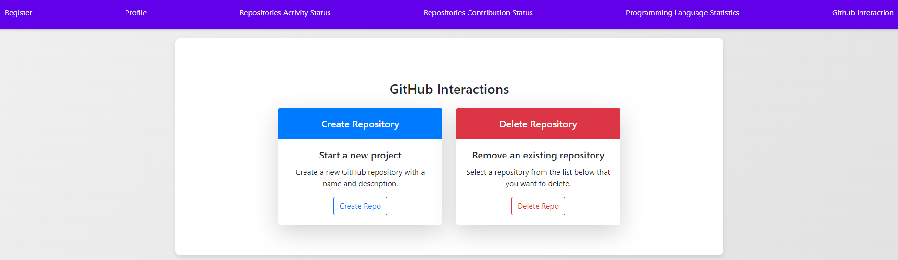
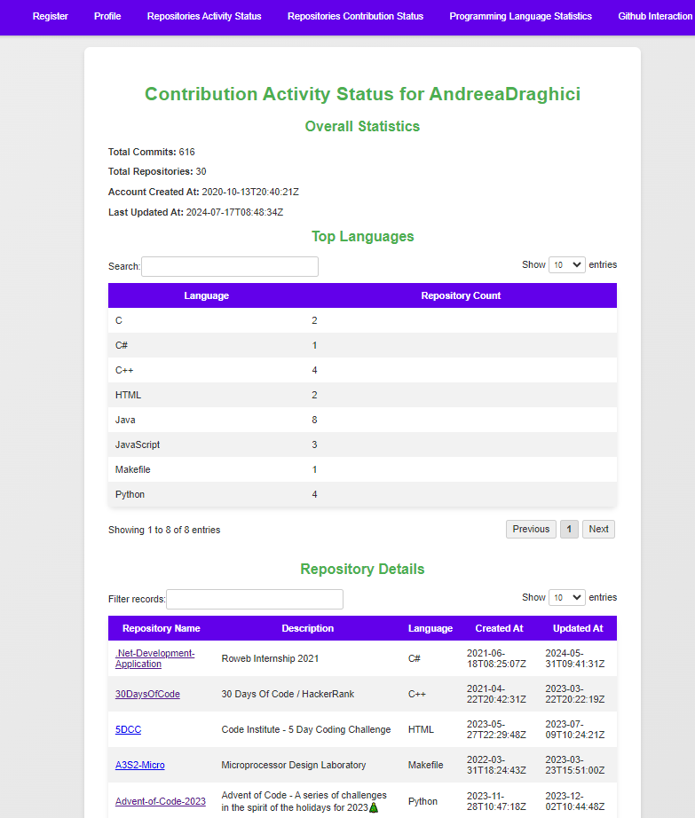
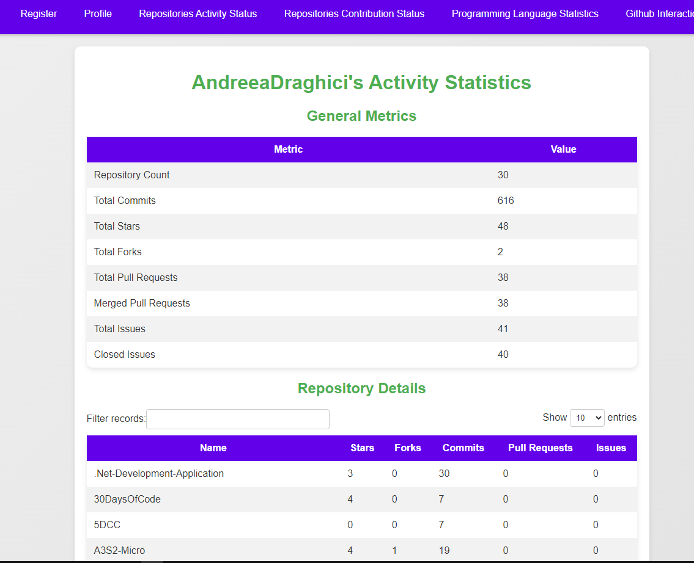
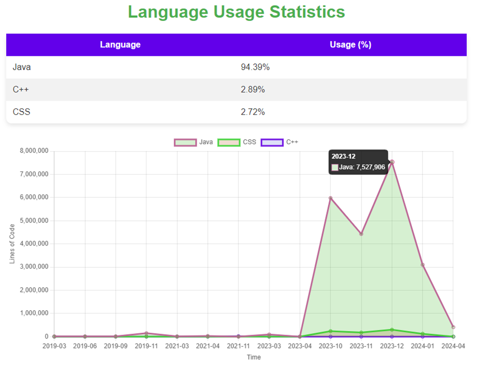

GitHub-Metrics-Dashboard
-----------------------------------------

This application serves as a web interface for interacting with GitHub. It allows users to log in with their GitHub
account, view their repositories, and perform various actions such as creating and deleting repositories. The app
provides detailed statistics on user contributions, including commits, pull requests, issues, and programming languages
used.

## **Features**

* **User Authentication:** Log in using a GitHub username.
* **Profile Display:** View profile information and repository details.
* **Repository Management:** Create and delete repositories.
* **Statistics Display:** View contributions statistics including commits, pull requests, issues, and language usage.

## **Setup and Installation**

#### 1. Prerequisites:

* Python 3.10
* Django 5.0.7
* GitHub Personal Access Token

#### 2. Installation

Clone the repository:

`git clone <repository-url>`

`cd <repository-directory>`

#### 3. Install dependencies

Use the provided requirements.txt file to install the necessary packages:

`pip install -r requirements.txt`

#### 4. Configure Environment Variables

Create a .env file in the root directory of your project and add the following environment variables:

`GITHUB_PERSONAL_ACCESS_TOKEN=<your-github-token>`

Alternatively, you can set these variables directly in your settings.py file under django.conf.settings.

#### 5. Run Database Migrations

python manage.py migrate

#### 6. Create a Superuser (optional)

To access the Django admin interface, create a superuser:

`python manage.py createsuperuser`

#### 7. Run the Development Server

Start the Django development server:

`python manage.py runserver` or run in command prompt the _run_server.bat_

The application should now be accessible at http://127.0.0.1:8000/.

## **Usage**

**Register/Login:**

* Navigate to the login page and enter your GitHub username.
  

  * Upon successful login, you will be redirected to your profile page.
    
    

**View and Manage Repositories:**

* From the profile page, you can view a list of your repositories.
* Use the "Create Repository" button to add new repositories.
* You can also delete existing repositories.

**View Contribution Stats:**

* Navigate to the "Repositories Contribution Stats" page to view detailed statistics on your GitHub activities,
  including commits, pull
  requests, and issues.
  

**Language Statistics:**

* The "Repositories Language Statistics" page provides a breakdown of the programming languages used in your
  repositories. As well as a chart of the evolution of programming languages in time.
  

## **Additional Notes**

- Ensure that your GitHub Personal Access Token has the necessary permissions to access the API endpoints used by the
  application, such as repo and user scopes.

- For production use, consider configuring a secure setup, such as setting up HTTPS and a production-ready web server
  like Gunicorn or uWSGI with Nginx.

